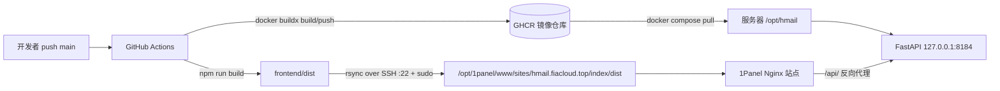

## 产品概述

为 Hmail 项目增加一套 GitHub Actions 自动化部署流水线：推送到 `main` 分支后，自动在 CI 中完成构建，再一键推送到生产服务器并上线。服务器资源有限，绝不承担编译工作，只负责拉取镜像、接收静态资源与重启容器。

## 核心功能

- **触发方式**：push 到 `main` 分支（以及手动触发）即启动部署流水线。
- **CI 内构建**：在 GitHub Actions 中构建后端容器镜像并构建前端静态产物，服务器本地不执行任何构建。
- **镜像分发**：后端镜像推送至 GHCR（`ghcr.io`），服务器仅 `docker compose pull`。
- **静态资源分发**：前端构建产物通过 SSH 传输并覆盖服务器目标目录。
- **服务器目录约定**：后端代码、`compose` 与 Git 相关内容放置于 `/opt/hmail`；前端页面放置于 `/opt/1panel/www/sites/hmail.fiacloud.top/index/dist`。
- **凭据配置**：通过 `SERVER_HOST`、`SERVER_USER`、`SERVER_SSH_KEY` 三个机密（Secrets）连接服务器，SSH 端口固定 22；部署用户具备 sudo 免密权限。
- **环境配置**：服务器端 `.env` 手工维护一次，自动化流程只读取不覆盖。
- **上线校验**：部署后重启应用容器并等待健康检查通过，失败可感知。
- **反向代理**：给出 nginx 的 `/api` 反向代理配置片段，供已由 1Panel 配置好 HTTPS 证书的站点直接插入使用。

## 技术选型

- **流水线**：GitHub Actions（`ubuntu-latest`），使用官方 `actions/*` 完成检出、Node 环境、构建产物上传下载。
- **容器仓库**：GHCR（`ghcr.io/<owner>/hmail-backend`），CI 用内置 `GITHUB_TOKEN` + `packages: write` 推送，服务器 `docker login ghcr.io`（私有包）或设为 Public 后免登录拉取。
- **部署通道**：SSH（端口 22）+ `rsync`/`ssh`，部署用户具备 `sudo` NOPASSWD，用于写 1Panel 站点目录与执行 `docker compose`。
- **运行编排**：沿用现有 Docker Compose 体系，新增生产专用编排文件（不再使用源码挂载与本地构建）。
- **静态托管**：1Panel 内置 OpenResty/Nginx，站点根目录指向 `/opt/1panel/www/sites/hmail.fiacloud.top/index/dist`。
- **后端构建底座**（沿用）：`backend/Dockerfile`（python:3.12-slim），容器启动时自动执行 `python -m app.migrate && uvicorn app.main:app`。
- **前端构建底座**（沿用）：Node 22+，`vue-tsc -b && vite build`，输出 `frontend/dist`。

## 实现思路

核心策略是「构建与运行彻底分离」：CI 完成全部编译与镜像打包，服务器只做拉取与替换。

- 保留现有 `compose.yaml` 作为本地开发编排不动（避免影响本地开发体验与既有约定），新增 `compose.prod.yaml`，其 `api` 服务以 `image: ${HMAIL_IMAGE}` 引用 GHCR 镜像，**删除 `build` 段与 `./backend/app:/app/app` 源码挂载**——这是保证「服务器不构建 + 运行镜像内代码」的关键前提。
- 服务器 `/opt/hmail` 存放 `compose.yaml`（由 CI 同步自 `compose.prod.yaml`）、`backend/` 源码、`scripts/`、`docs/` 与手工维护的 `.env`；同步采用 rsync 并 `--exclude=.env --exclude=.git`，确保配置与本地 git 内容不被链路覆盖。
- 前端产物同步到站点 `dist` 目录时使用 `rsync --delete --chmod=D755,F644`，彻底清理旧哈希文件，避免残留导致白屏或旧资源被引用。
- 环境变量沿用 Compose 的 `${VAR}` 插值（读取同目录 `.env`），生产必需项为 `HMAIL_IMAGE`、`POSTGRES_PASSWORD`、`TOKEN_ENCRYPTION_KEY`、`PUBLIC_URL=https://hmail.fiacloud.top`、`SMTP_*`、`GOOGLE_*`。
- 发布采用健康门控：`docker compose pull` → `docker compose up -d --remove-orphans --wait`，任一容器未 healthy 即判定部署失败。数据库迁移由容器 CMD 在启动时自动执行，无需额外步骤，但需保证 api 单副本。

### 关键技术决策与取舍

- **为何新增 `compose.prod.yaml` 而非改造原文件**：原文件含开发用途的源码挂载，生产使用会让宿主机源码覆盖镜像内代码，且残留 `build` 段会诱使服务器构建。新增文件隔离风险，且不破坏本地开发流程。
- **为何用 GHCR 而非本地 `docker save`**：镜像层可复用、拉取增量小，CI 无需传输数百 MB 压缩包；代价是需给服务器配置 `read:packages` 凭据或将包设为 Public。
- **为何 `--delete` 只用于前端目录**：`/opt/hmail` 内的 `.env`、`.git` 属于服务器侧资产，不能因同步被删；而 `dist` 目录必须清理陈旧哈希资源。
- **为何 rsync 用 `--rsync-path="sudo rsync"`**：目标目录属 root（1Panel 创建），借助 NOPASSWD sudo 直接写入，避免二次改权限与临时目录中转。

### 性能与可靠性

- 镜像构建启用 BuildKit 缓存，后端依赖仅在 `requirements.txt` 变化时重装；前端 `npm ci` 命中 Actions 缓存。
- CI 内后端构建默认使用官方 PyPI（`https://pypi.org/simple`）以适配 GitHub Runner 网络，可通过仓库变量覆盖。
- 发布为幂等操作：重复执行同一提交不会产生副作用；并发保护使用 `concurrency` 组串行化，避免同站点并发覆盖。
- 服务器不做编译，CPU/内存占用仅为拉取镜像与重启容器。

## 实施要点（落地细节）

- **同源校验**：`backend/app/main.py` 对非 GET/HEAD/OPTIONS 请求校验 `Origin == PUBLIC_URL`，因此服务器 `PUBLIC_URL` 必须精确为 `https://hmail.fiacloud.top`（无结尾 `/`），且 nginx **不得重写 `Origin` 或 `Host`**，否则写请求返回 403。
- **真实 IP**：限流依据请求头 `x-real-ip`，反向代理必须透传 `X-Real-IP $remote_addr`。
- **请求体上限**：附件上限 18 MiB，MIME base64 膨胀后请求体可达约 24 MiB，nginx（或 1Panel 站点设置）需将 `client_max_body_size` 设为 `30m`，否则大附件上传报 413。
- **超时**：Gmail/IMAP 邮件操作可能较慢，`proxy_read_timeout`/`proxy_send_timeout` 设为 `600s`（与 `vite.config.ts` 的 600000ms 一致）。
- **凭据安全**：`SERVER_SSH_KEY` 仅写入 runner 临时文件并 `chmod 600`，全流程不 `echo`、不落日志；服务器 `.env` 不进入仓库、不被 CI 覆盖。
- **不产生额外修改**：不改动 `compose.yaml`、`backend/`、`frontend/` 源码与既有文档主体，仅在文档中新增部署章节，控制改动影响面。

## 架构设计



## 目录结构

```
Hmail/
├── .github/
│   └── workflows/
│       └── deploy.yml            # [NEW] 部署流水线。触发：push main/workflow_dispatch；含两个 Job：
│                                 #   build：Buildx 构建 backend 镜像并推送 ghcr.io/<owner>/hmail-backend
│                                 #     （tag: latest 与 <sha>），Node 22 执行 npm ci && npm run build，
│                                 #     上传 frontend/dist 为 artifact；
│                                 #   deploy（needs build）：下载 dist，配置 SSH 私钥(600)、known_hosts，
│                                 #     用 sudo rsync 同步 compose 与静态产物，再 ssh 执行远端脚本并等待健康检查。
│                                 #   权限 packages: write；concurrency 串行化；Secrets: SERVER_HOST/SERVER_USER/SERVER_SSH_KEY。
├── compose.prod.yaml             # [NEW] 生产编排。api 使用 image: ${HMAIL_IMAGE}，无 build 段、无源码挂载；
│                                 #   保留 127.0.0.1:8184:8000 端口、healthcheck、restart；db/redis 与卷沿用现有定义；
│                                 #   环境变量保持 ${POSTGRES_PASSWORD}/${TOKEN_ENCRYPTION_KEY}/${PUBLIC_URL}/SMTP_*/GOOGLE_* 插值。
├── .env.production.example       # [NEW] 生产配置模板。列出 HMAIL_IMAGE、POSTGRES_PASSWORD、TOKEN_ENCRYPTION_KEY、
│                                 #   PUBLIC_URL=https://hmail.fiacloud.top、SMTP_*、GOOGLE_CLIENT_ID/SECRET，
│                                 #   并注明服务器上另存为 /opt/hmail/.env，勿提交仓库、勿被 CI 覆盖。
├── scripts/
│   └── deploy-remote.sh          # [NEW] 服务器端发布脚本（由 CI 通过 ssh 调用）。职责：进入 /opt/hmail，
│                                 #   校验 .env 存在，sudo docker compose -f compose.yaml pull，
│                                 #   up -d --remove-orphans --wait，输出 ps 状态；失败以非零码退出。
└── docs/
    └── GITHUB-DEPLOY.md          # [NEW] 部署文档。包含：GitHub Secrets 配置、服务器初始化（目录/权限/docker login ghcr.io）、
                                  #   .env 生产配置、首次部署与回滚、以及 nginx 反向代理配置片段（/api → 127.0.0.1:8184）
                                  #   与站点根目录指向 dist 的说明。
```

说明：`README.md` 增加一节“自动部署”，链接到 `docs/GITHUB-DEPLOY.md`；其余源码文件不改动。

## 关键配置（反向代理片段，供 1Panel 站点使用）

在 1Panel「网站 → hmail.fiacloud.top → 配置文件」的 `server` 块中加入（或使用面板“反向代理”功能指向 `http://127.0.0.1:8184`）：

```
# 站点根目录指向前端构建产物
root /opt/1panel/www/sites/hmail.fiacloud.top/index/dist;
index index.html;

# SPA 路由回退
location / {
    try_files $uri $uri/ /index.html;
}

# 后端 API 反向代理
location /api/ {
    proxy_pass http://127.0.0.1:8184;
    proxy_http_version 1.1;
    proxy_set_header Host $host;                       # 不得改写，后端按 Origin 做同源校验
    proxy_set_header X-Real-IP $remote_addr;           # 后端限流依赖该头
    proxy_set_header X-Forwarded-For $proxy_add_x_forwarded_for;
    proxy_set_header X-Forwarded-Proto $scheme;
    client_max_body_size 30m;                          # 覆盖 18 MiB 附件 + base64 膨胀
    proxy_read_timeout 600s;
    proxy_send_timeout 600s;
    proxy_request_buffering off;
}

# 带哈希的静态资源长缓存
location /assets/ {
    expires 1y;
    add_header Cache-Control "public, max-age=31536000, immutable";
}
```

## Key Code Structures

服务器 `.env`（`/opt/hmail/.env`）生产必需字段示意：

```
HMAIL_IMAGE=ghcr.io/<owner>/hmail-backend:latest
POSTGRES_PASSWORD=<高强度随机密码>
TOKEN_ENCRYPTION_KEY=<Fernet 密钥>
PUBLIC_URL=https://hmail.fiacloud.top
GOOGLE_CLIENT_ID=<生产客户端 ID>
GOOGLE_CLIENT_SECRET=<生产客户端密钥>
SMTP_HOST=smtp.qq.com
SMTP_PORT=465
SMTP_USER=<验证码发信账号>
SMTP_PASS=<SMTP 授权码>
SMTP_FROM="Hmail <no-reply@xxx>"
```